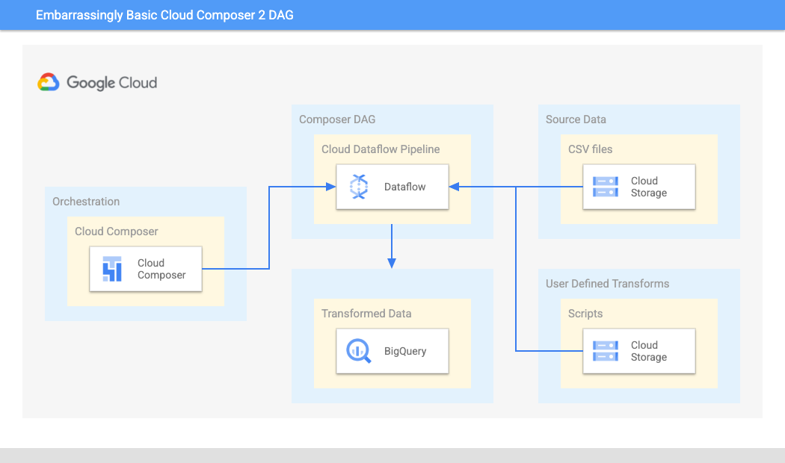

# About

This module covers creating an ultra basic DAG that reads a CSV file from GCS, transforms it and loads it into BigQuery from Cloud Dataflow.<br>
It is based off of a [sample in the GCP documentation](https://cloud.google.com/composer/docs/how-to/using/using-dataflow-template-operator), with some enhancements such as BYO VPC subnet, use a service account etc.<br>

Here is a pictorial overview-<br>


<br>

### Goal
Ensure permissions and configuration work for a data integration pipeline involving GCS, Cloud Dataflow, and BigQuery, so that we have a minimum viable pipeline for trying out event driven DAG execution.


## 1. Review the DAG script

a) From cloud shell, navigate to the directory where the script is located
```
cd ~/composer2-basic-orchestration/00-scripts/data-integration-dag/1-dag-base/
```

b) Review the DAG Python script "ultra_basic_gcs_cdf_bq_dag.py" available [here](00-scripts/data-integration-dag/1-dag-base/ultra_basic_gcs_cdf_bq_dag.py)

It reads files from GCS, maps/transforms and loads the data into BigQuery, via Cloud Dataflow.
It uses a Dataflow template available in Cloud storage for the same.
This template accepts parameters for the transformation function, source and sink paths and such.

## 2. Variables for the lab

In cloud shell, lets define variables to use

```
ADMIN_FQ_UPN="admin@akhanolkar.altostrat.com" # Replace with your admin UPN
PROJECT_NUMBER=508201578739 # Replace with your project number
PROJECT_ID=composer-2-playground # Replace with your project ID if different

UMSA="agni-sa"
UMSA_FQN=$UMSA@$PROJECT_ID.iam.gserviceaccount.com

VPC_NM=composer-2-vnet
VPC_FQN=projects/$PROJECT_ID/global/networks/$VPC_NM
SUBNET_NM=composer-2-snet

REGION=us-central1

COMPOSER_ENV_NM=cc2-agni
USE_PUBLIC_IPS=true

DATAFLOW_SUBNET="https://www.googleapis.com/compute/v1/projects/$PROJECT_ID/regions/$LOCATION/subnetworks/$SUBNET_NM"

SRC_FILE_STAGING_BUCKET_PATH=gs://$PROJECT_ID-dag-input-files
BQ_DATASET_NM=average_weather_ds
BQ_TABLE_NM=average_weather

```

## 3. Create a BigQuery dataset and table

From cloud shell, run the commands below.

### 3.1. Create the dataset
```
bq --location=$LOCATION mk \
--dataset \
$PROJECT_ID:$BQ_DATASET_NM
```


### 3.2. Create the table
```
bq mk \
--table \
$PROJECT_ID:$BQ_DATASET_NM.$BQ_TABLE_NM \
location:GEOGRAPHY,average_temperature:INTEGER,month:STRING,inches_of_rain:NUMERIC,is_current:BOOLEAN,latest_measurement:DATE
```

## 4. Create a GCS bucket, stage the source files, and grant IAM permissions 

### 4.1. Create the bucket from cloud shell
```
gsutil mb -c standard -p $PROJECT_ID -l $LOCATION $SRC_FILE_STAGING_BUCKET_PATH
```


### 4.2. Review the files, and understand their purpose

1) Navigate to the local directory in the Git repo cloned, in cloud shell-
```
cd ~/composer2-basic-orchestration/01-pipeline-input
```
2) Review data file - inputFile.txt
```
POINT(40.7128 74.006),45,'July',2,true,2020-02-16
POINT(41.8781 87.6298),23,'October',13,false,2015-02-13
POINT(48.8566 2.3522),80,'December',8,true,2022-01-10
POINT(6.5244 3.3792),15,'March',14,true,2021-01-01
```

3) Review the schema file - jsonSchema.json<br>

The data above does not make sense without a schema; Lets review the schema file needed for Cloud dataflow, to read, parse, map, transform and load to BigQuery
```
{
    "BigQuery Schema": [
    {
        "name": "location",
        "type": "GEOGRAPHY",
        "mode": "REQUIRED"
    },
    {
        "name": "average_temperature",
        "type": "INTEGER",
        "mode": "REQUIRED"
    },
    {
        "name": "month",
        "type": "STRING",
        "mode": "REQUIRED"
    },
    {
        "name": "inches_of_rain",
        "type": "NUMERIC"
    },
    {
        "name": "is_current",
        "type": "BOOLEAN"
    },
    {
        "name": "latest_measurement",
        "type": "DATE"
    }]
}
```
5) Review the JSON transform function - transformCSVtoJSON.js<br>

This function just splits the data in the file, into an object, and finally returns it as a JSON string-
```
function transformCSVtoJSON(line) {
var values = line.split(',');

var obj = new Object();
obj.location = values[0];
obj.average_temperature = values[1];
obj.month = values[2];
obj.inches_of_rain = values[3];
obj.is_current = values[4];
obj.latest_measurement = values[5];

var jsonString = JSON.stringify(obj);

return jsonString;
}
```


### 4.3. Copy the source files to the staging bucket
```

cd ~/composer2-basic-orchestration/01-pipeline-input/
gsutil cp jsonSchema.json $SRC_FILE_STAGING_BUCKET_PATH
gsutil cp transformCSVtoJSON.js $SRC_FILE_STAGING_BUCKET_PATH
gsutil cp inputFile.txt $SRC_FILE_STAGING_BUCKET_PATH
```

## 5. Configure Composer Environment Variables
The DAG expects some environment variables.<br>
Lets set the same-<br>


1) Project ID
```
gcloud beta composer environments run $COMPOSER_ENV_NM \
  --location $LOCATION \
  variables set -- \
  project_id $PROJECT_ID 
```

2) GCS bucket path for source files
```
gcloud beta composer environments run $COMPOSER_ENV_NM \
--location $LOCATION \
variables set -- \
source_file_bucket_path $SRC_FILE_STAGING_BUCKET_PATH
```

3) Subnet to deploy Dataflow into
```
gcloud beta composer environments run $COMPOSER_ENV_NM \
--location $LOCATION \
variables set -- \
dataflow_subnet $DATAFLOW_SUBNET
```

4) max_active_runs_per_dag
```
gcloud beta composer environments run $COMPOSER_ENV_NM \
--location $LOCATION \
variables set -- \
max_active_runs_per_dag 1
```

5) BigQuery dataset name
```
gcloud beta composer environments run $COMPOSER_ENV_NM \
--location $LOCATION \
variables set -- \
bq_ds $BQ_DATASET_NM
```

6) BigQuery table name
```
gcloud beta composer environments run $COMPOSER_ENV_NM \
--location $LOCATION \
variables set -- \
bq_tbl_nm $BQ_TABLE_NM
```

7) User Managed Service Account (UMSA) Fully Qualified Name (FQN)
```
gcloud beta composer environments run $COMPOSER_ENV_NM \
--location $LOCATION \
variables set -- \
umsa_fqn $UMSA_FQN
```

8) User PubliC IPs
```
gcloud beta composer environments run $COMPOSER_ENV_NM \
--location $LOCATION \
variables set -- \
use_public_ips_in_dataflow $USE_PUBLIC_IPS
```

## 6. Deploy the DAG to Cloud Composer 2

Run the below command to deploy the DAG

```
cd ~/composer2-basic-orchestration/00-scripts/data-integration-dag/1-dag-base/
```

```
gcloud composer environments storage dags import \
--environment $COMPOSER_ENV_NM  --location $LOCATION \
--source ultra_basic_gcs_cdf_bq_dag.py \
--impersonate-service-account $UMSA_FQN
```

Review the DAG deployment in the GCS bucket for the Cloud Composer environment.

## 7. Switch to the Cloud Composer Aiflow Web UI and view the DAG execution and check results

You should see the DAG listed as running...


## 8. Switch to the Cloud Dataflow UI and view the pipeline execution 

Switch to the Cloud Console, and navigate to Cloud Dataflow-
<br>
1. Notice that the Dataflow job has started
<br>
2. Explore the DAG
<br>
3. Explore the DAG execution logs
<br>
4. Once it completes, go to the BigQuery UI


## 9. Switch to the BigQuery UI and view the results

Switch to BigQuery in the Cloud Console and run the query-
```
select * from `composer-2-playground.average_weather_ds.average_weather`
```

You should see the following results-
```
4 records...properly parsed out.
```

## 10. Switch back to the Airflow UI

Note the successful DAG completion.

## 11. What's next?

Lets look at event driven orhcestration of the Cloud Composer 2 "Hello World" DAG from earlier, in response to a Cloud Pub/Sub message.<br>
Proceed to the [next module](05-edo-pubsub-event.md).
