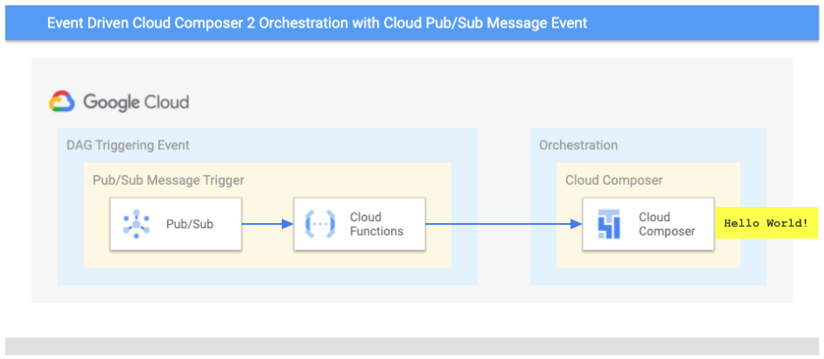

# About

This module builds on the "Hello World" exercise, by adding the orchestration element to it.<br>
Specifically, Pub/Sub message event driven orchestration.<br>
Here is a pictorial overview of this basic sample.



<hr>

## 1.0. Variables

In Cloud Shell, declare the following vars-
```
ADMIN_FQ_UPN="xxxcom" # Replace with your admin UPN
PROJECT_NUMBER=xxx # Replace with your project number
PROJECT_ID=composer-2-playground # Replace with your project ID if different

UMSA="agni-sa"
UMSA_FQN=$UMSA@$PROJECT_ID.iam.gserviceaccount.com

COMPOSER_ENV_NM=cc2-agni
LOCATION=us-central1
DAG_ID=hello_world_dag

PUB_SUB_TRIGGER_TOPIC=$PROJECT_ID-$PROJECT_NUMBER-hw-edo-topic
```

<hr>

## 2.0. Create a Google Pub/Sub topic

```
gcloud pubsub topics create $PUB_SUB_TRIGGER_TOPIC
```

<hr>

## 3.0. Get the Airflow Web URL

```
AIRFLOW_URI=`gcloud composer environments describe $COMPOSER_ENV_NM \
    --location $LOCATION \
    --format='value(config.airflowUri)'`
```

<hr>

## 4.0. Review the Airflow DAG executor script

In cloud shell, navigate to the scripts directory for the exercise-
```
cd ~/composer2-basic-orchestration/00-scripts/hello-world-dag/3-dag-pubsub-orchestrated/
```

Open and review the script below-
```
cat composer2_airflow_rest_api.py
```

Do not change any variables.<br>
The Cloud Function we will author, imports this file from the main.py file.

<hr>

## 5.0. Review the Python dependencies file

Open and review the script below-
```
cat requirements.txt
```

<hr>

## 6.0. Review the GCF main python file

Open and review the script below-
```
cat main.py
```

Notice that there are two variables to be replaced-<br>
AIRFLOW_URI_TO_BE_REPLACED<br>
and<br>
DAG_ID_TO_BE_REPLACED<br>

<hr>

## 7.0. Update the GCF main python file

1. Replace WEB_SERVER_URL_TO_BE_REPLACED in main.py with your env specific value

```
sed -i "s|AIRFLOW_URI_TO_BE_REPLACED|$AIRFLOW_URI|g" main.py
```

2. Replace DAG_NAME_TO_BE_REPLACED in main.py with your env specific value
```
sed -i "s|DAG_ID_TO_BE_REPLACED|$DAG_ID|g" main.py
```

3. Validate
```
cat main.py
```

You should see the actual Airflow URI and the DAG ID

<hr>

## 8.0. Deploy the Google Cloud Function (GCF) to run as UMSA

Takes approximately 2 minutes.

```
USE_EXPERIMENTAL_API='False'

gcloud functions deploy cc2_hello_world_pubsub_trigger_fn \
--entry-point trigger_dag_gcf \
--trigger-topic $PUB_SUB_TRIGGER_TOPIC \
--runtime python39 \
--set-env-vars USE_EXPERIMENTAL_API=${USE_EXPERIMENTAL_API} \
--service-account=${UMSA_FQN}
```

a) In the cloud console, navigate to Cloud Functions-
<br>
Validate successful deployment of the GCF

<hr>

## 9.0.Test the function from cloud shell

1. Publish a message to Cloud Pub/Sub trigger topic
```
CURRENT_TIME=`date -d "-6 hours"`
gcloud pubsub topics publish $PUB_SUB_TRIGGER_TOPIC --message "$CURRENT_TIME"
```

2. Go to the Cloud Function Logs, in the cloud console and check for errors..<br>


3. And then go to Airflow web UI and click on the DAG node, and look at the logs...<br>


4. Publish multiple messages to the Pub/Sub topic and explore DAG runs in the Airflow UI...<br>
You should see the number of runs incrementing
<br>

<hr>

## 10.0. What's next?

Lets learn how to launch the Cloud Composer 2 "Hello World" DAG in response to a Cloud Storage object event.<br>
Proceed to the [next module](06-edo-gcs-event.md).
