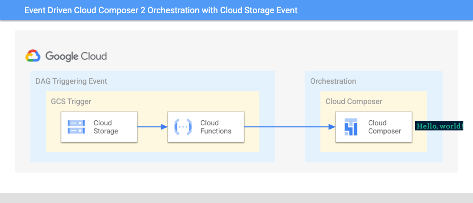

# About

This module builds on the "Hello World" exercise, by adding the orchestration element to it.<br>
Specifically, GCS bucket event driven orchestration.<br>

FIRST and foremost - read this [GCP documentation](https://cloud.google.com/composer/docs/composer-2/triggering-with-gcf) to get an understanding of what we are about to attempt. Start with step 1, once done.<br>

Here is a pictorial overview of this basic sample.



<hr>

## 1.0. Create a GCS trigger bucket

From cloud shell, run the commands below-

a) The variables
```
ADMIN_FQ_UPN="admin@akhanolkar.altostrat.com" # Replace with your admin UPN
PROJECT_NUMBER=508201578739 # Replace with your project number
PROJECT_ID=composer-2-playground # Replace with your project ID if different

UMSA="agni-sa"
UMSA_FQN=$UMSA@$PROJECT_ID.iam.gserviceaccount.com

REGION=us-central1

COMPOSER_ENV_NM=cc2-agni

GCF_TRIGGER_BUCKET_FQN=gs://$PROJECT_ID-$PROJECT_NUMBER-hw-gcs-edo-bucket

DAG_ID=hello_world_dag
```

b) Create a bucket
```
gsutil mb -p $PROJECT_ID -c STANDARD -l $REGION -b on $GCF_TRIGGER_BUCKET_FQN
```

## 2.0. Get the Airflow Web URL

```
AIRFLOW_URI=`gcloud composer environments describe $COMPOSER_ENV_NM \
    --location $REGION \
    --format='value(config.airflowUri)'`
```

Validate:
```
echo $AIRFLOW_URI
```

## 3.0. Review the Airflow DAG executor script

In cloud shell, navigate to the scripts directory for the exercise-
```
cd ~/composer2-basic-orchestration/00-scripts/hello-world-dag/2-dag-gcf-orchestrated
```

Open and review the script below-
```
cat composer2_airflow_rest_api.py
```

Do not change any variables.<br>
The Cloud Function we will author, imports this file from the main.py file.

## 4.0. Review the Python dependencies file

Open and review the script below-
```
cat requirements.txt
```

## 5.0. Review the GCF main python file

Open and review the script below-
```
cat main.py
```

Notice that there are two variables to be replaced-<br>
AIRFLOW_URI_TO_BE_REPLACED<br>
and<br>
DAG_ID_TO_BE_REPLACED<br>

## 6.0. Update the GCF main python file

1. Replace WEB_SERVER_URL_TO_BE_REPLACED in main.py with your env specific value

```
sed -i "s|AIRFLOW_URI_TO_BE_REPLACED|$AIRFLOW_URI|g" main.py
```

2. Replace DAG_NAME_TO_BE_REPLACED in main.py with your env specific value
```
sed -i "s|DAG_ID_TO_BE_REPLACED|$DAG_ID|g" main.py
```

3. Validate the replacement of the placeholders with your environment specific Airflow URI and DAG name
```
cat main.py
```

You should see the actual Airflow URI and the DAG ID

## 7.0. Deploy the Google Cloud Function (GCF) to run as UMSA

Takes approximately 2 minutes.

```
USE_EXPERIMENTAL_API='False'


gcloud functions deploy cc2_hello_world_gcs_trigger_fn \
--entry-point trigger_dag_gcf \
--trigger-resource $GCF_TRIGGER_BUCKET_FQN \
--trigger-event google.storage.object.finalize \
--runtime python39   \
--set-env-vars USE_EXPERIMENTAL_API=${USE_EXPERIMENTAL_API} \
--service-account=${UMSA_FQN}
```

a) In the cloud console, navigate to Cloud Functions-<br>

Review the deployment


## 8.0.Test the function from cloud shell

```
touch dummy.txt
gsutil cp dummy.txt $GCF_TRIGGER_BUCKET_FQN
rm dummy.txt
```

Go to the Cloud Function Logs, in the cloud console and check for errors..
<br><br>


## 9.0. Validate DAG execution in Airflow UI
Go to Airflow web UI and click on the DAG node, and look at the logs...
<br>
<br>
<hr>

This concludes the module.

