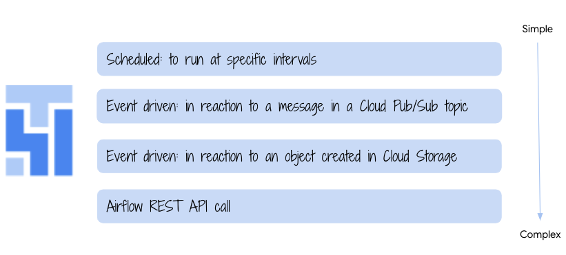

# Orchestration Basics with Cloud Composer 2

The repository contains instructions, code, configuration & input files for basic hands on experience with Cloud Composer 2 and orchestrating DAGs impersonating a User Managed Service Account. The DAG is embarrassigly basic to maintain focus on orchestration and is based off of a sample in the public Google Cloud docs. 

This is a community contribution. Please open an issue for any bugs you run into.

  

  

## 1. Get started

Dive into the lab, starting with the [prerequisites module](02-prerequisites.md) and run through modules, in the exact same sequence as the module number.

## 2. Dont forget to..

Delete resources created after completing the lab.

## Credits

Author: Anagha Khanolkar, Google Cloud 
Testing: Jay O' Leary, Google Cloud
