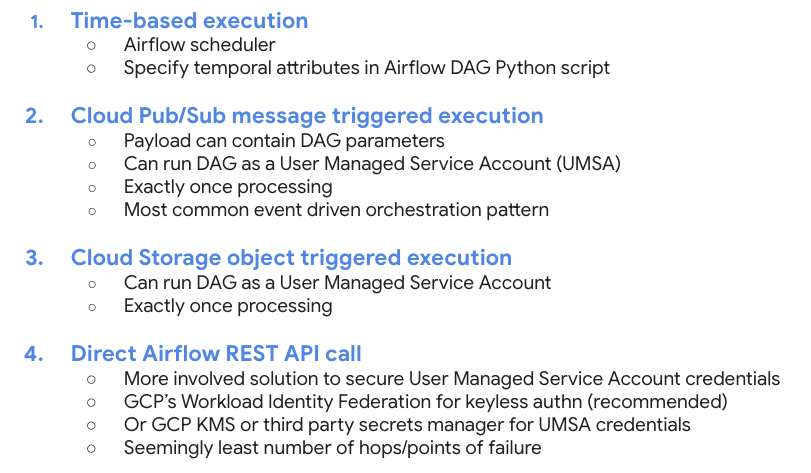

# Orchestration Basics for Cloud Composer 2

The repository contains instructions, code, configuration & input files for basic hands on experience with Cloud Composer 2 and orchestrating DAGs impersonating a User Managed Service Account. This is a community contribution. Please open an issue for any bugs you run into.

### 1. Orchestrating Cloud Composer 2 DAGs

  

  

### 2. Get started

Dive into the lab, starting with the [prerequisites module](02-prerequisites.md) and run through module, in the exact same sequence as the module number.

### 3. Dont forget to..

Delete resources created after completing the lab.
